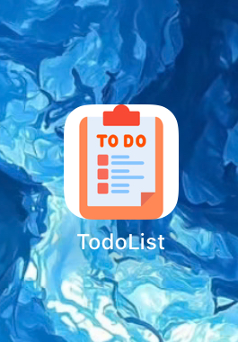
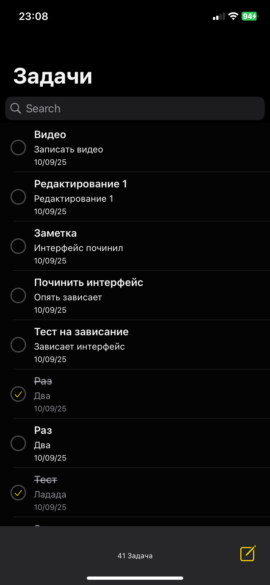
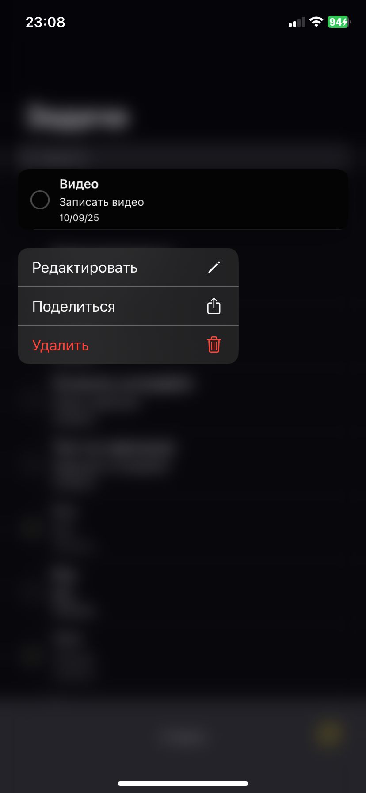
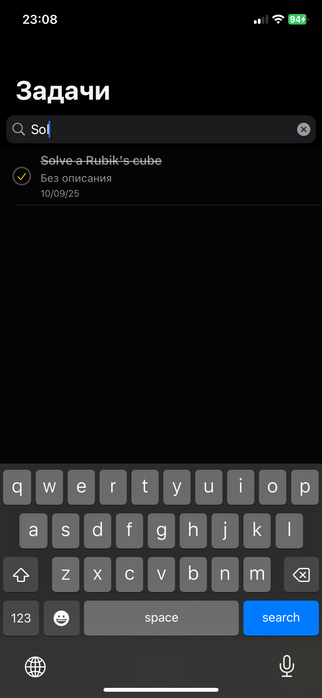
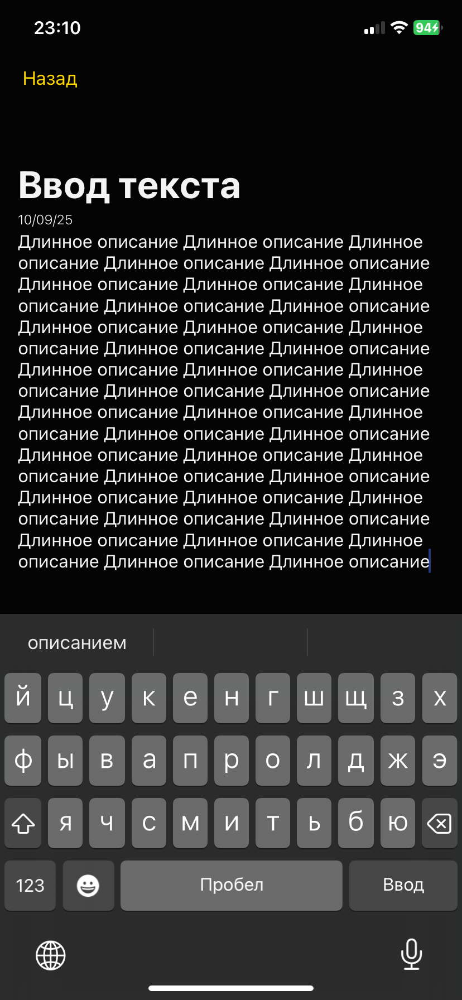

# TodoList

**TodoList** — это приложение для управления задачами, выполненное в рамках тестового задания.  

Проект реализован с использованием **VIPER**, **UIKit**, **SnapKit**, **Core Data**, **GCD** и **CocoaPods**.

---

##  Функционал

- Просмотр списка задач
- Добавление новой задачи
- Редактирование и удаление задач
- Поиск по задачам
- Локальное хранение данных с Core Data
- Асинхронная загрузка данных с использованием GCD
- Контекстное меню для редактирования, удаления и шаринга задач

---

##  Скриншот

  
  
  
  
  
  

---

##  Видео

[Смотреть видео](https://youtube.com/shorts/G2E4z4rnJLU?si=W4KLlB3ZyU8gS_y6)

---

##  Технологии

- Swift + UIKit
- VIPER архитектура
- SnapKit для верстки
- Core Data для локального хранения
- GCD для асинхронной работы
- CocoaPods для управления зависимостями

---

